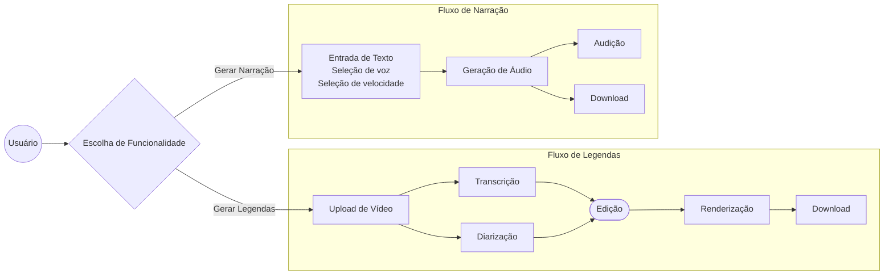

<h1 align="center">Projeto de Legendas e Narração</h1>

Projeto acadêmico que consiste em uma **aplicação web completa para processamento de mídia**, com foco em **Inteligência Artificial aplicada à legendagem e narração de vídeos**.

A aplicação combina uma interface moderna em **React** com uma **API robusta em FastAPI (Python)**, integrando modelos da OpenAI e bibliotecas avançadas como **Whisper** e **Pyannote.audio** para oferecer resultados de alta precisão.

<div align="center">
    
[](https://www.python.org/)
[](https://n8n.io/)
[](https://react.dev/)


[](https://fastapi.tiangolo.com/)
[](https://openai.com/pt-BR/index/whisper/)
[](https://www.pyannote.ai/blog/community-1)
[](https://www.ffmpeg.org/)

</div>

## Créditos
- [Lucas Christian](https://github.com/lucaschr21)
- [Marcos Derick](https://github.com/MrcsBrigida)
- [Lucas Soares](https://github.com/Lucaslssoares)
- [João Vitor](https://github.com/vitorez)
- Gustavo Santiago
- Luiz Carvalho
- Alan Leão

## Funcionalidades Principais

### Fluxo do usuário



**Geração e Edição de Legendas:**

1. **Upload:**  
   O usuário seleciona um vídeo (ex: `.mp4`) no frontend.

2. **Processamento de IA:**  
   O backend realiza duas tarefas:
   - **Transcrição (SST):** O áudio é processado pelo **OpenAI Whisper** para gerar texto com *timestamps*.  
   - **Diarização:** O áudio é processado pelo **Pyannote.audio** para identificar os interlocutores.

3. **Edição no Frontend:**  
   O usuário pode:
   - Corrigir o texto da transcrição.  
   - Ajustar cores, fontes e estilo das legendas.

4. **Renderização Final:**  
   O backend utiliza **FFmpeg** para “queimar” as legendas estilizadas diretamente no vídeo e disponibiliza o arquivo final para download.

**Narração (Text-to-Speech):**

1. **Entrada de Texto:**  
   O usuário insere ou cola um roteiro no frontend.

2. **Seleção de Voz:**  
   O usuário define seleciona vozes pré-definidas (masculina, feminina, etc).

3. **Orquestração via n8n:**  
   Ao clicar em “Gerar Áudio”, o backend pode acionar um **workflow no n8n**, que utiliza a **API de TTS da OpenAI**.

4. **Geração e Retorno:**  
   Os blocos de texto são transformados em áudio, combinados em um único arquivo `.mp3` e enviados ao usuário para audição ou download.


## Arquitetura e Estrutura do Projeto

O projeto segue **boas práticas de engenharia de software** (princípios SOLID), com separação clara entre camadas e responsabilidades.
- **main.py** — Ponto de entrada da aplicação FastAPI, inicializa rotas e configurações gerais.  
- **models/** — Contém os schemas Pydantic usados para validação e definição de contratos de dados.  
    - `subtitle.py`: schemas relacionados aos dados de legenda.
- **routes/** — Define os endpoints HTTP que expõem as funcionalidades da API.
    - `subtitle.py`: endpoint dos serviços de legenda.
- **services/** — Implementa a lógica principal de IA e processamento:  
  - `transcription.py`: transcrição de áudio com Whisper.  
  - `diarization.py`: diarização de locutores com Pyannote.  
  - `rendering.py`: renderização de vídeo/áudio via FFmpeg.  
  - `subtitle.py`: orquestra geração e sincronização de legendas. 


## Gerenciamento de Desempenho

- **Lazy Loading:**  
  Modelos pesados (Whisper e Pyannote) são carregados **sob demanda** (apenas na primeira execução).  
  O carregamento é controlado com `threading.Lock` para ser *thread-safe*.

- **Tratamento de Áudio:**  
  FFmpeg realiza a extração e reamostragem do áudio para **16kHz mono**, o formato exigido pelos modelos de IA.

## Instalação e Execução
> [!CAUTION]
> Atualmente o projeto só funciona no Linux (testado em distros baseadas em debian) devido a problemas de renderização envolvendo o FFmpeg no Windows.

> [!WARNING]
> É recomandável ter uma GPU Nvidia com suporte ao [CUDA](https://developer.nvidia.com/cuda-gpus) ou GPU AMD com suporte ao [ROCm](https://rocm.docs.amd.com/projects/install-on-linux/en/latest/reference/system-requirements.html), caso contrário, os modelos de IA serão executados via CPU, reduzindo drasticamente a velocidade da transcrição e diarização.

### Instalar Pré-requisitos
#### Instalar CUDA (ignore caso vá executar via CPU ou via ROCm)
```bash
wget https://developer.download.nvidia.com/compute/cuda/repos/ubuntu2404/x86_64/cuda-ubuntu2404.pin
sudo mv cuda-ubuntu2404.pin /etc/apt/preferences.d/cuda-repository-pin-600
wget https://developer.download.nvidia.com/compute/cuda/13.0.2/local_installers/cuda-repo-ubuntu2404-13-0-local_13.0.2-580.95.05-1_amd64.deb
sudo dpkg -i cuda-repo-ubuntu2404-13-0-local_13.0.2-580.95.05-1_amd64.deb
sudo cp /var/cuda-repo-ubuntu2404-13-0-local/cuda-*-keyring.gpg /usr/share/keyrings/
sudo apt-get update
sudo apt-get -y install cuda-toolkit-13-0
sudo apt-get install -y cuda-drivers
```
#### Instalar ROCm (ignore caso vá executar via CPU ou via CUDA)
```bash
wget https://repo.radeon.com/amdgpu-install/7.1/ubuntu/noble/amdgpu-install_7.1.70100-1_all.deb
sudo apt install ./amdgpu-install_7.1.70100-1_all.deb
sudo apt update
sudo apt install python3-setuptools python3-wheel
sudo usermod -a -G render,video $LOGNAME 
sudo apt install rocm
wget https://repo.radeon.com/amdgpu-install/7.1/ubuntu/noble/amdgpu-install_7.1.70100-1_all.deb
sudo apt install ./amdgpu-install_7.1.70100-1_all.deb
sudo apt update
sudo apt install "linux-headers-$(uname -r)" "linux-modules-extra-$(uname -r)"
sudo apt install amdgpu-dkms
```

#### Instalação Obrigatória
```bash
sudo apt update
sudo apt install python3
sudo apt install ffmpeg
curl -o- https://raw.githubusercontent.com/nvm-sh/nvm/v0.40.2/install.sh | bash
\. "$HOME/.nvm/nvm.sh"
nvm install 24
```
### Clonar o Repositório
```bash
git clone https://github.com/lucaschr21/multimidia
cd multimidia
```

### Criar o Ambiente Virtual
```bash
uv venv --python 3.13.9
source .venv/bin/activate
```

### Instalar Depêndencias
```bash
uv sync
cd UI
npm install
cd ..
```

### Executar
```bash
uvicorn src.main:app
```
Abra outro terminal, então digite:
```bash
cd UI
npm start
npm run dev
```


